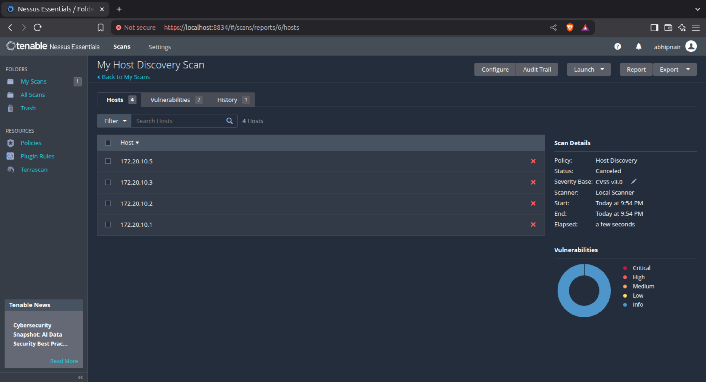
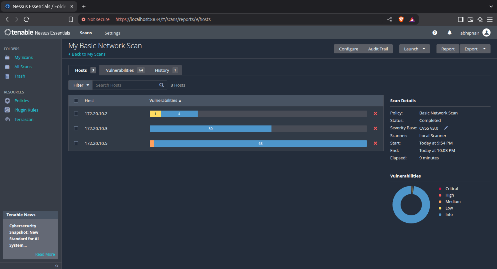
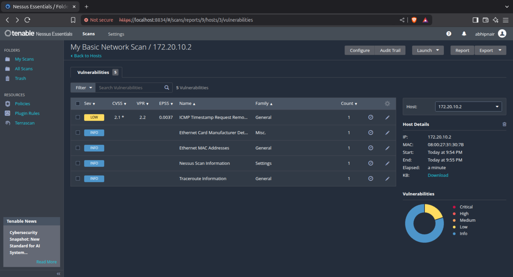
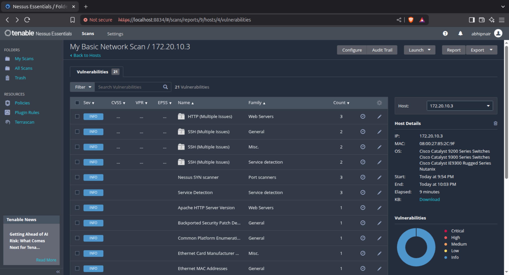
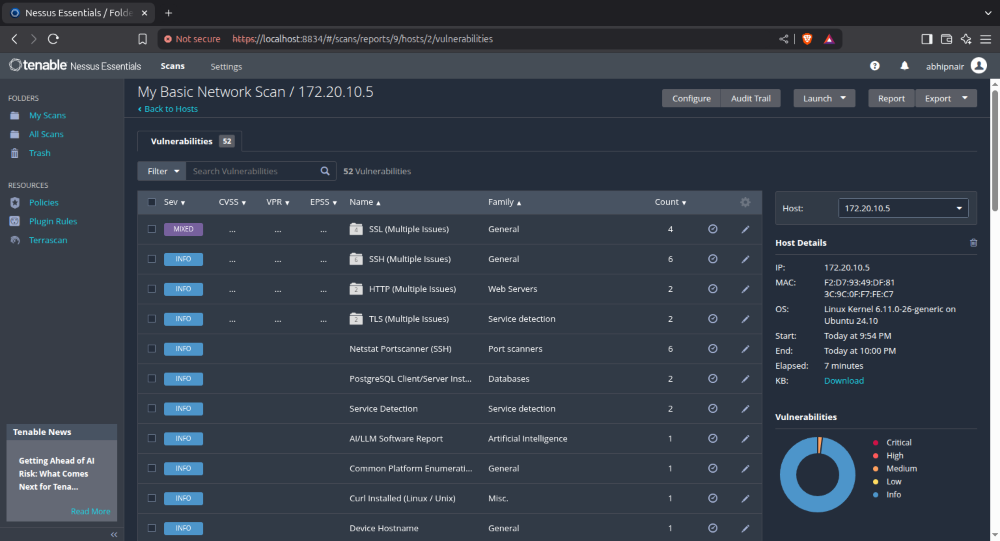

# Nessus: Vulnerability Scanning Tool

🔍 What is Nessus?

Nessus is a powerful, widely-used vulnerability scanner developed by Tenable. It helps security professionals:

1. Detect vulnerabilities and misconfigurations.
2. Identify missing patches.
3. Scan systems, networks, and web applications.
4. Generate detailed security reports.
5. Nessus is popular for its ease of use, detailed reports, and vast plugin database.

## ⚙️ Quick Nessus Installation Guide (Debian Linux)
1. Download Nessus for Debian/Ubuntu

Visit the official Nessus download page

2. Install Nessus
```bash
sudo dpkg -i Nessus-<version>-debian10_amd64.deb
sudo apt --fix-broken install -y
```

3. Start and Enable Nessus Service

```bash
sudo systemctl start nessusd
sudo systemctl enable nessusd
```

4. Access Web Interface

Open your browser and visit:

    https://localhost:8834

Note: Proceed if SSL warning appears.

5. Initial Setup

    Choose Nessus Essentials (free) or another edition.

    Create a user account.

    Get and enter an activation code from: https://www.tenable.com/products/nessus/nessus-essentials

    Wait for plugin download to finish.

## 🛡️ Nessus Scanning Guide

📄 1. Create a New Scan

    Go to the "Scans" tab on the left sidebar.

    Click on "New Scan".

📚 2. Choose a Scan Template

Select a suitable template based on your goal. Common ones:

    1. Basic Network Scan: General-purpose scan for open ports, vulnerabilities.

    2. Advanced Scan: Customizable with credentials, scripts, etc.

    3. Web Application Tests: Scan web apps for OWASP vulnerabilities.

    4. Host Discovery: Identify live hosts without performing vulnerability checks.

📝 4. Configure the Scan

    Name: Give your scan a name.

    Targets: Enter IP addresses, domain names, or ranges.

        Example: 10.10.1.0/24 or scanme.nmap.org

    Optional tabs:

        Schedule: Automate scan frequency.

        Credentials: Add SSH, SMB, or web login info for deeper scanning.

        Plugins: Enable/disable specific vulnerability checks.

▶️ 5. Launch the Scan

    Click Save then hit the Play/Launch icon next to your scan.

⏳ 6. Monitor Scan Progress

    View status under My Scans.

    Scan time depends on targets and plugins used.

📊 7. Analyze Scan Results

    Click on the completed scan.

    You'll see:

        Vulnerability Summary: Critical, High, Medium, Low issues.

        Host Information: Open ports, OS, services.

        Detailed Findings: Description, solution, CVSS scores, etc.

📥 8. Export Reports (Optional)

    Export results via HTML, PDF, CSV, or Nessus format.

    Useful for sharing with teams or documentation.


## My Network Scan results

1. Host Discovery


2. Basic Scan


3. Scan Deatils of Each hosts (selected hosts only)




    Note: You can see the vulnerabilities note that these are not much effective and cve score is low(info)